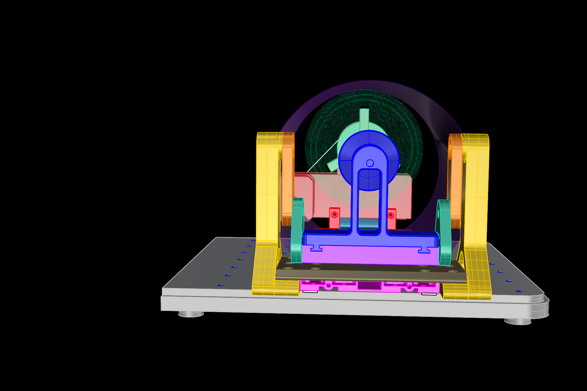

# xTool-RA2_addon
3D printable addon for the xTool F1 Ultra RA2 tool to rotate cups 360° for laser engraving. Created with Rhino 8. 

You can mount the addon to the F1 Ultra base plate using 4 mm screws. 
There are two versions included. The first one is one base part and two holders for the RA2 tool.
The second one is splitted into to parts which can be plugged together.
You can mount the RA2-base-plate to the fixture.

Requirements:
* 3D printer 
* PETG Filament of your choice

To assemble the RA2 tool:
You need the two long black M3 screws that came with the RA2 tool. They fix the RA2 tool to the aluminium bed. 
Unscrew them and put them into the ground part of the RA2 holder to fix it to the front side of the aluminium bed. 
* 1x M6 x 75 mm screw (axis) (i used 80 mm because i had one)
* 1x M4 x 75 mm screw to fix the angle (i used 80 mm because i had one)
* 2x M3 x 40 mm screws for the RA2 tool ( i used 60 mm and cutted it with the Engineer PA-24 Crimptool)

To assemble the RA2 addon:
* 2x M6 x 20 mm Inbus flathead (head is 12x1,4 mm, Inbus size 4)
*    + 2x M6 nuts
* 2x M6 x 30 mm Inbus flathead (head is 12x1,4 mm, Inbus size 4)
*    + 2x M6 nuts
* 1x M3 x 15 mm Inbus flathead, Inbus size 2
* 6x M3 x 12 mm Inbus flathead, Inbus size 2 (3 for each side of the bridge tower)
*    + 6x M3 nuts
* 2x M3 x 10 mm Inbus flathead, Inbus size 2 (to fasten the bridge to the alu bed)
*    + 2x M3 square nuts (5,2x5,x*2 mm)

To fix the whole tool to the xTool base plate 1 or up to 3 M4 x 10-12 mm.

## View

 

  

